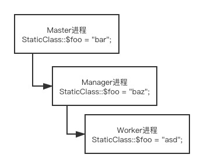

# Swoole 多进程概念

由于 Swoole 和 传统的 php-fpm 工作原理完全不一样，而且引入了多进程的概念，会使得传统 PHP 开发者一头雾水，这是什么东西？其实 Swoole 多进程说简单也不简单，说复杂理清楚了就不那么复杂了。下面会为你梳理一下 Swoole 的多进程概念，我会尽量用通俗易懂的白话来编写。

## 和 FPM 模式的不同

FPM模式就是我们传统的浏览器请求到 `xxx.php` 文件后，Web 服务器将请求打给 php-fpm 监听的端口或通过 unix-socket 传递，PHP 解释器解释完后将返回结果返回给 Web 服务器，完成了一次 PHP 的调用。

而 Swoole 类似 Node.js，Python，它是依靠 php-cli 模式在命令行常驻运行的模式，相当于自己起了一个 Web 服务器。所以他自己会运行一个甚至多个进程来协作。

## 为什么不用多线程而是多进程呢

众所周知，PHP 对多线程的支持非常不好，而对多线程的著名应用都体验不是很好（如 PocketMine-MP），所以 Swoole 构建了一种多进程模式的方案。

## 有哪些进程

1. Master 进程
2. Worker 进程
3. TaskWorker 进程
4. Manager 进程
5. Reacter 线程

Master 进程你可以理解为，你使用 `php xxx.php` 这个指令起来的最外层的父进程，它总是最先创建。

Manager 进程是由 Master 进程创建的子进程，它用来管理 Worker 进程，TaskWorker 进程。

Worker 进程为主要的逻辑处理部分，框架内你写的所有模块都运行在 Worker 进程里。Worker 进程由 Manager 进程创建。

TaskWorker 进程是可选进程，如果在配置文件中设置了 `task_worker_num` 的话，就会创建 TaskWorker 进程。

Reacter 线程是 Swoole 内部在 Master 进程中创建的线程，负责处理 `TCP` 连接，处理协议和收发数据。

## 全局变量与进程的关系

在某种角度上，一个进程下运行的代码是和另一个进程毫无关系的。也就是比如你编写的模块的代码运行在 Worker 进程里，Manager 和 Master 进程浑然不知，你甚至可以看作是同时运行了不同的几个 php 脚本，但是关联在于他们是父子进程的关系。

我们知道 PHP 语言是世界上最好的语言，所以 PHP 有大量的全局函数，全局变量可供开发者使用，我们在平时开发 php-fpm 项目时，为了省事和高效，常常用静态类型（static）或全局变量 `global` 来储存交换数据。而在 Swoole 世界中的多进程结构下，静态类型不再静态，全局变量不再全局！

其实也没那么玄乎，就是一个顺序的关系，就像学生抄作业一样，看图就知道全局变量在多进程中怎么回事了！

首先根据上面的叙述，我们的服务进程创建顺序为：Master -> Manager -> Worker

- 假设我在 Master 进程中运行的事件函数里面读取 `StaticClass::$foo` 变量，那么值是多少呢？
- 在 Worker 进程中呢？

假设我们的框架已经完全启动，看到了 `=== Worker #0 ===` 之类的字样，你的代码逻辑如 `@CQCommand` ，`@RequestMapping` 等代码，都是在 Worker 进程中运行的，这时你读取这个变量的值肯定是 `asd`。但是如果你使用了例如 `@OnEvent("managerStart")` 之类绑定了 Manager 进程的自定义 Swoole 事件函数，在那个函数下读取 `StaticClass::$foo` 变量获取的就会是 `baz`，它并没有根据你在 Worker 中赋值而改变，Master 进程也是如此。

但是如果你不在 Worker 进程中给此变量赋值，直接读取的话就会读取到父进程的值，比如 `baz`。

也就是说，**子进程会克隆父进程的变量，而子进程和父进程的内存空间是独立的**。要想在不同进程间通信，见 [Swoole - 进程间通信](https://wiki.swoole.com/)。

## TaskWorker 进程

其实 TaskWorker 进程和我们的 Worker 进程是平级的，比如同样会触发 `workerStart` 事件，同样是由 Manager 进程创建。但是不同点在于，使用 TaskWorker 进程需要设置 `@OnEvent("task")` 对 `onTask` 事件进行绑定并且对参数设置 `task_worker_num` 才能使用。这里先留个坑，TaskWorker 主要是用于逻辑代码运行时间较长的代码，比如对巨型数组进行排序、递归逻辑等，可以有效利用多核心 CPU。如果你对此感兴趣，可先阅读 Swoole 文档下的 TaskWorker 进程相关的使用方式，框架在 1.6 版本起支持自定义 Swoole 核心事件的绑定后可以自由使用框架暴露的原生 Swoole 接口。

