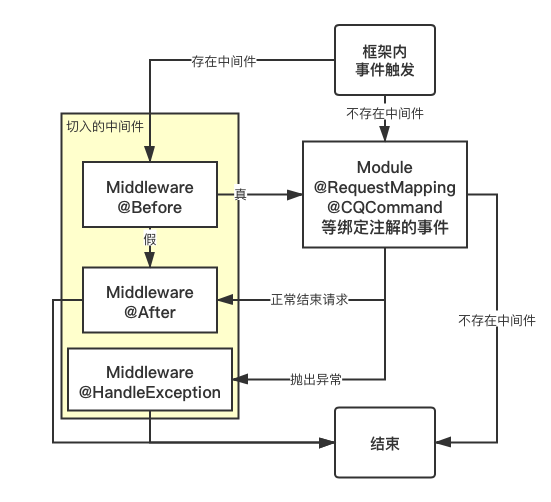
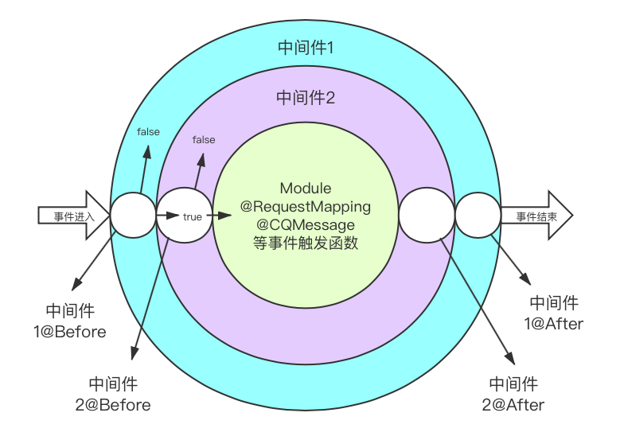

# 中间件注解

对于 `@RequestMapping` 等注解绑定的事件函数，还支持中间件，可以完成 Session 会话、认证、日志记录等功能。中间件是用于控制 `请求到达` 和 `响应请求` 的整个流程的。从一定意义上来说相当于切面编程（AOP）。

从 1.3.0 版本开始，框架内除即将废除的 `@SwooleEventAfter`、`@CQAfter` 等注解事件和模块类修饰注解（如 `@Closed` 外，所有绑定事件的注解方法都可以插入中间件。

## 中间件流程

如果以宏观角度来说中间件的执行流程，则为下图：



对于一个注解事件的函数绑定多个中间件的流程为：



## 定义中间件

只需要实现 `\ZM\Http\MiddlewareInterface` 接口的 `getName()` 方法，返回一个合法的名称即可。例如下方就是一个可以在终端打印路由函数运行的总时间的中间件：

```php
<?php
namespace Module\Middleware;
use Framework\Console;
use ZM\Annotation\Http\After;
use ZM\Annotation\Http\Before;
use ZM\Annotation\Http\MiddlewareClass;
use ZM\Http\MiddlewareInterface;
/**
 * Class AuthMiddleware
 * 示例中间件：用于统计路由函数运行时间用的
 * @package Module\Middleware
 * @MiddlewareClass()
 */
class TimerMiddleware implements MiddlewareInterface {
    private $starttime;
    /**
     * @Before()
     * @return bool
     */
    public function onBefore() {
        $this->starttime = microtime(true);
        return true;
    }
    /**
     * @After()
     */
    public function onAfter() {
        Console::info("Using " . round((microtime(true) - $this->starttime) * 1000, 2) . " ms.");
    }
    public function getName() { return "timer"; }
}
```


## 使用中间件

通过 `@Middleware("中间件名称")` 来给路由函数进行绑定中间件。

`@Middleware` 的所在命名空间为：`\ZM\Annotation\Http\Middleware`。

```php
/**
 * @RequestMapping("/test/ping")
 * @Middleware("timer")
 */
public function pong(){
  Co::sleep(1);
  return "pong";
}
```

如果你的所在类中的成员方法都需要绑定的中间件，而每个函数前方声明太繁琐，则可以在所在类的前面声明使用中间类，这样每一个方法都会进行中间件的流程。

```php
/**
 * @Middleware("timer")
 */
class Hello extends ModBase {
  /**
   * @RequestMapping("/test/ping")
   */
  public function ping(){
    return "pong";
  }
}
```

::: warning 版本更新

对于对类进行修饰从而使每个函数都绑定中间件的功能在 1.1.1 版本起可用。

:::

## 使用多个中间件

多个使用中间件可以同时生效多个流程的中间件。这里要注意，多个中间件中，`@Before` 方法中如果返回了 `false`，则不会执行接下来的中间件和事件本身要触发的函数，直接跳到最后此中间件的 `@After` 方法。

```php
/**
 * @CQCommand("你好")
 * @Middleware("timer1")
 * @Middleware("timer2")
 */
public function hello() { return "成功执行！"; }
```


## 使用中间件捕获异常

通常情况下，如果用户定义的函数内抛出了异常（包括 `message` 等事件），会返回到框架基层去返回默认定义的内容。如果想自己捕获可以使用 `try/catch` ，但不方便复用，多处使用的话就需要重复写代码。这里可以使用中间件的异常处理方便地捕获错误。这个函数写到中间件类里即可

```php
/**
 * @HandleException(\Exception::class)
 * @param Exception|null $e
 */
public function onThrowing(?Exception $e) {
    context()->getResponse()->endWithStatus(500, "Error on this.");
}
```

这里的 `@HandleException` 中的参数为要捕获的类名，注意这里面的类名的命名空间需要写全称，不能上面 use 再使用，否则会无法找到异常类。

`context()` 为获取当前协程空间绑定的 `request` 和 `response` 对象。