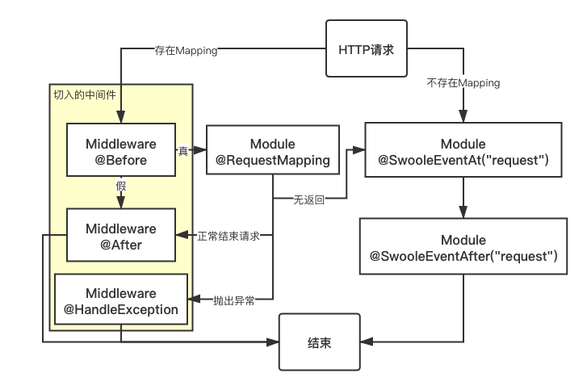

# HTTP 服务器

最先开始的时候，我们说了 炸毛框架 不仅仅是聊天机器人的框架，还是一个完整的 HTTP + WebSocket 服务器，你不仅可以开发机器人功能，框架还可用于开发任何 Web 应用程序，构建高性能的 Web 系统、API、中间件、基础服务等。

::: tip 提示

炸毛框架的注解和 HTTP 服务器控制器响应方式高度类似 **Swoft** 框架，如果你熟悉 Swoft 框架的话，这里学习起来将会非常容易。

:::

## 功能特色

- 基于 `@RequestMapping` 和 `@Controller` 的路由注解
- 提供简单的参数支持
- 响应迅速，无任何臃肿的框架代码，无过多封装，直接操作原生的 Swoole 对象

在一般情况下，我们启动了炸毛框架后，HTTP 服务器就自动启动了，访问框架监听的地址和端口，就可以访问 HTTP 服务。

## 控制器和路由

控制器主要通过 `@Controller` 注解实现。此注解仅适用于对类进行修饰。

- 名称：`@Controller`
- 命名空间：`ZM\Annotation\Http\Controller`
- 参数：`*prefix`
- 作用：声明此类下所有路由的根路由地址。

- 名称：`@RequestMapping`
- 命名空间：`ZM\Annotation\Http\RequestMapping`
- 参数：`*route`，`name`，`method`
- 作用：路由地址

### 路由规则

通常情况，一个完整的路由 `path` 等于 `@Controller` 的 `prefix` + `@RequestMapping` 的 `route`。例如：

```php
<?php
namespace Module\Example;
use ZM\ModBase;
use ZM\Annotation\Http\Controller;
use ZM\Annotation\Http\RequestMapping;
/**
 * @Controller("/api")
 */
class Test extends ModBase {
    /**
     * @RequestMapping("/index")
     */
    public function index(){
        //context()->getResponse()->end("This is API index page");
        $this->response->end("This is API index page");
    }
  	/**
  	 * @RequestMapping("/ping")
  	 */
    public function ping(){
        $this-response->end("pong");
    }
}
```

以上编写后，从浏览器访问 `http://127.0.0.1:20001/api/index` 时就会访问到 `This is API index page`，访问 `/api/ping` 时就会返回 `pong`。

::: tip 提示

当 `@Controller` 为 `/` 的时候，效果和不写是一样的，`@RequestMapping` 为 `/` 或 `/index/inside` 等多级路由也是可以的。

:::

## 绑定参数

在 `@RequestMapping` 中，不仅可以写静态的路由地址，也可以写绑定的参数。例如：`@RequestMapping(route="/index/{name}")`，则访问 `/index/xxx` 的时候，你在函数方法内可以这样获取此参数：

```php
public function index($arg) {
    $this->response->end("Your param 'name' is ".$arg["name"]);
}
```

## 设置路由请求方式

如果想要设置允许请求控制器的 HTTP 请求方式，可以使用方法在控制器中的 `@RequestMapping` 注解配置 `method` 参数，可以是 `GET`，`POST`，`PUT`, `PATCH`，`DELETE`，`OPTIONS`，`HEAD` 中的一个或多个。

- 限定 HTTP 方法：`@RequestMapping(method="GET")`，`@RequestMapping(method={"GET","POST"})`

## 事件可用的基类变量

- `$this->request`：`swoole_http_request` 对象，可查阅 [Swoole 文档](https://wiki.swoole.com/#/http_server?id=httprequest)
- `$this->response`：`swoole_http_response` 对象，可查阅 [Swoole 文档](https://wiki.swoole.com/#/http_server?id=httpresponse)

::: tip 提示
对于 `Request` HTTP 请求事件，在函数内还可以使用 `context()->getRequest()` 和 `context()->getResponse()` 来获取上述对象。
:::

## 中间件

对于 `@RequestMapping` 方法，还支持中间件，完成 Session 会话、认证等功能。中间件是用于控制 `请求到达` 和 `响应请求` 的整个流程的。从一定意义上来说相当于切面编程（AOP）。目前该中间件仅支持 `@RequestMapping` 绑定的路由函数。

### 定义中间件

只需要实现 `\ZM\Http\MiddlewareInterface` 接口的 `getName()` 方法，返回一个合法的名称即可。例如下方就是一个可以在终端打印路由函数运行的总时间的中间件：

```php
<?php
namespace Module\Middleware;
use Framework\Console;
use ZM\Annotation\Http\After;
use ZM\Annotation\Http\Before;
use ZM\Annotation\Http\MiddlewareClass;
use ZM\Http\MiddlewareInterface;
/**
 * Class AuthMiddleware
 * 示例中间件：用于统计路由函数运行时间用的
 * @package Module\Middleware
 * @MiddlewareClass()
 */
class TimerMiddleware implements MiddlewareInterface {
    private $starttime;
    /**
     * @Before()
     * @return bool
     */
    public function onBefore() {
        $this->starttime = microtime(true);
        return true;
    }
    /**
     * @After()
     */
    public function onAfter() {
        Console::info("Using " . round((microtime(true) - $this->starttime) * 1000, 2) . " ms.");
    }
    public function getName() { return "timer"; }
}
```

### 通过注解使用

通过 `@Middleware("中间件名称")` 来给路由函数进行绑定中间件。

`@Middleware` 的所在命名空间为：`\ZM\Annotation\Http\Middleware`。

```php
/**
 * @RequestMapping("/test/ping")
 * @Middleware("timer")
 */
public function pong(){
  Co::sleep(1);
  return "pong";
}
```

### 异常处理

通常情况下，如果用户定义的函数内抛出了异常（包括 `message` 等事件），会返回到框架基层去返回默认定义的内容。如果想自己捕获可以使用 `try/catch` ，但不方便复用，多处使用的话就需要重复写代码。这里可以使用中间件的异常处理方便地捕获错误。这个函数写到中间件类里即可

```php
/**
 * @HandleException(\Exception::class)
 * @param Exception|null $e
 */
public function onThrowing(?Exception $e) {
    context()->getResponse()->endWithStatus(500, "Error on this.");
}
```

这里的 `@HandleException` 中的参数为要捕获的类名，注意这里面的类名的命名空间需要写全称，不能上面 use 再使用，否则会无法找到异常类。

`context()` 为获取当前协程空间绑定的 `request` 和 `response` 对象。

### 处理流程图

 

## HTTP 客户端

框架内依赖了 Swoole 官方推荐的 `Saber`，可直接在任意位置使用。这里是 [Saber 地址](https://github.com/swlib/saber)。

对于 GET 请求 和 POST 请求，框架内也封装了轻量的函数调用，如果使用 `file_get_contents` 类和 `curl_exec` 之类的网络请求函数，在 `1.1` 版本之后开启了一键协程化，也可以正常使用。Saber 和框架内的轻量化函数都是协程优化的，也都可以正常使用。

框架内的轻量函数见组件中 [ZMRequest 组件](/guide/component.html#zmrequest-http-客户端)